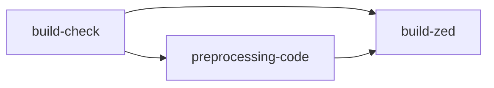

# Zed Action

## Deepwiki
[](https://deepwiki.com/reigadegr/zed_action)

# Zed Editor 自动化构建系统

<p align="center">
  
  
  
</p>

基于 GitHub Actions 的 Zed 编辑器多平台自动化构建系统,支持自定义优化配置和中文本地化。

## ✨ 特性

- 🚀 **多平台支持**: Linux (x86_64/aarch64)、Windows (x86_64)、macOS (x86_64/Apple Silicon)
- 🔧 **双工具链**: 支持 Rust stable 和 nightly 工具链
- 🌏 **中文本地化**: 可选集成 tc999/zed-loc 和 reigadegr/zed-translation
- ⚡ **性能优化**: 内置编译器优化补丁和内存管理调优
- 🔄 **自动化清理**: 智能管理工作流运行记录和缓存

## 🎯 支持的构建目标

| 平台 | 架构 | Target Triplet |
|------|------|----------------|
| Linux | x86_64 | `x86_64-unknown-linux-gnu` |
| Linux | ARM64 | `aarch64-unknown-linux-gnu` |
| Windows | x86_64 | `x86_64-pc-windows-msvc` |
| macOS | x86_64 | `x86_64-apple-darwin` |
| macOS | Apple Silicon | `aarch64-apple-darwin` |

## 🚀 快速开始

### 手动触发构建

1. 进入 Actions 标签页
2. 选择 "Release Build" 工作流
3. 点击 "Run workflow"
4. 配置构建参数:
   - **TOOLCHAINS**: 选择 `nightly` 或 `stable`
   - **TARGET**: 选择目标平台
   - **TRANSLATION**: 是否启用中文本地化

### 构建产物

构建完成后,在 Actions 运行页面下载对应的 artifact:
- 文件名格式: `{TARGET}_zed`
- 包含内容: 
  - `zed` 或 `zed.exe` 可执行文件
  - `commits.txt` 源码提交历史

## 🏗️ 架构设计

### 三阶段构建流程



1. **build-check**: 验证输入参数和构建策略
2. **preprocessing-code**: 源码克隆和本地化处理 (Ubuntu)
3. **build-zed**: 平台特定编译 (Linux/Windows/macOS)

### 环境优化

**编译器优化**:
- LTO (链接时优化)
- 自定义内存分配器 (mimalloc)
- 平台特定编译标志

## 🧹 维护工具

### 清理工作流

使用 "清理工作流运行记录和缓存" 工作流管理构建历史:

- ✅ 删除失败/成功/取消的运行记录
- 🔄 批量取消进行中的构建
- 🗑️ 清理 ccache 和 apt 缓存
- 📊 支持正序/倒序处理

## 📦 依赖项

### 系统依赖 (Linux)
```
musl-tools, build-essential, lld, llvm, clang
libdbus-1-dev, libwayland-dev, libwebkit2gtk-4.1-dev
libxdo-dev, pkg-config, libssl-dev, libx11-dev
libasound2-dev, libx11-xcb-dev, libxkbcommon-dev
```

### Rust 组件
- `rust-src`, `llvm-tools-preview`, `clippy`, `rustfmt`
- 目标平台工具链
- `wasm32-wasip1` (WebAssembly 支持)

## 🔧 高级配置

### 自定义构建脚本

构建脚本位于仓库根目录,命名格式: `build_{TOOLCHAIN}_{PLATFORM}.sh`

支持的组合:
- `build_nightly_linux.sh`
- `build_stable_windows.sh`
- `build_nightly_apple.sh`
- 等...

### 优化手段

- `patchs/zigbuild_mimalloc.patch`: cargo-zigbuild 内存分配器补丁
- `.cargo/config.toml`: Cargo 构建配置

## 📝 许可证

Apache License 2.0

## 🤝 贡献

欢迎提交 Issue 和 Pull Request!

## 📚 相关项目

- [zed-industries/zed](https://github.com/zed-industries/zed) - Zed 编辑器官方仓库
- [tc999/zed-loc](https://github.com/tc999/zed-loc) - Zed 本地化工具
- [Nriver/zed-translation](https://github.com/Nriver/zed-translation) - 另一个Zed 汉化仓库

<p align="center">Made with ❤️ by reigadegr</p>
